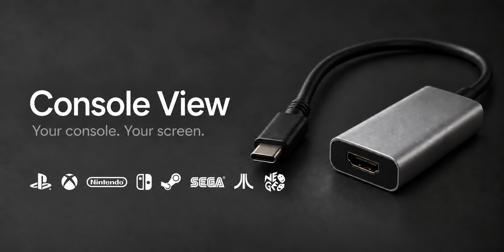
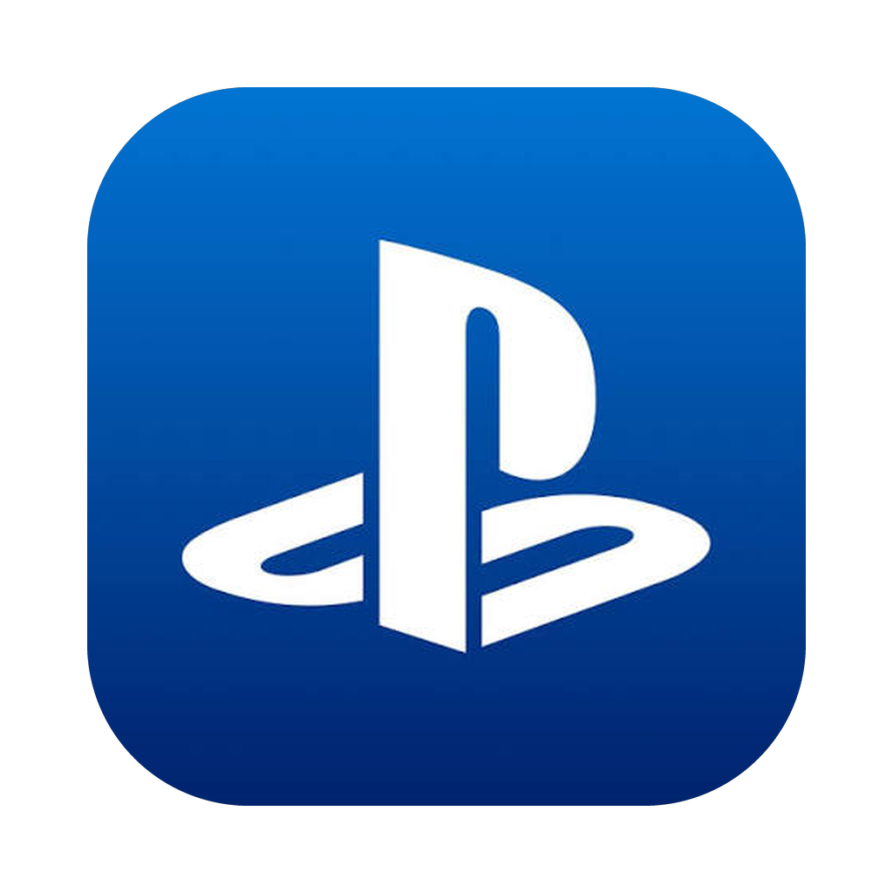

<p align="center">
  
</p>

<p align="center">
  
</p>

<h1 align="center">Console View</h1>
<p align="center">Your console. Your screen.</p>
<p align="center">
  <a href="#download">Download</a> ·
  <a href="#terminal-install">Terminal install</a> ·
  <a href="CONTRIBUTING.md">Contribute</a>
</p>

Connect an HDMI capture card. Open Console View. Play.

A minimal capture-card viewer, with a native macOS edition and a compatibility
edition for Linux, Windows, and older Intel Macs.
One external capture card connects automatically. With several cards, choose
the source you want. Temporary disconnections recover automatically.

Console View works with external video devices exposed by the operating
system, without restricting the console brand. The capture card, its drivers,
and HDMI content protection determine what can be captured. This is an
independent evolution of PS4 View.

## Download

| Your Mac | Download | Required system |
| --- | --- | --- |
| Apple Silicon — M-series | [Console View 1.0.1 — Apple Silicon](https://github.com/smailkorchi/console-view/releases/download/v1.0.1/Console-View-1.0.1-Apple-Silicon.dmg) | macOS 14 Sonoma or newer |
| Intel | [Console View 1.0.1 — Intel](https://github.com/smailkorchi/console-view/releases/download/v1.0.1/Console-View-1.0.1-Intel.dmg) | macOS 14 Sonoma or newer |

[Release notes](https://github.com/smailkorchi/console-view/releases/tag/v1.0.1)
· [SHA-256 checksums](https://github.com/smailkorchi/console-view/releases/download/v1.0.1/SHA256SUMS.txt)

The native Mac downloads are previews. A separate **compatibility preview**
provides Linux, Windows, and older Intel Mac packages:

| System | Download | Baseline |
| --- | --- | --- |
| Older Intel Mac | [Intel macOS compatibility DMG](https://github.com/smailkorchi/console-view/releases/download/v1.0.0-compatibility/Console-View-1.0.0-macOS-Intel-10.13.dmg) | Targets macOS 10.13 High Sierra or newer; tested on macOS 15 Intel |
| Windows 64-bit | [x64 installer](https://github.com/smailkorchi/console-view/releases/download/v1.0.0-compatibility/Console-View-1.0.0-Windows-x64-Setup.exe) · [Portable ZIP](https://github.com/smailkorchi/console-view/releases/download/v1.0.0-compatibility/Console-View-1.0.0-Windows-x64-Portable.zip) | Windows 10 or newer |
| Windows 32-bit | [x86 installer](https://github.com/smailkorchi/console-view/releases/download/v1.0.0-compatibility/Console-View-1.0.0-Windows-x86-Setup.exe) · [Portable ZIP](https://github.com/smailkorchi/console-view/releases/download/v1.0.0-compatibility/Console-View-1.0.0-Windows-x86-Portable.zip) | Windows 10 or newer |
| Linux | [Choose your processor and package](https://github.com/smailkorchi/console-view/releases/tag/v1.0.0-compatibility) | glibc 2.31+ or Alpine 3.22+; X11/XWayland |

Linux downloads cover **x86_64, ARM64, i386/SSE2, and ARMv7 hard-float**.
Debian, Ubuntu, and Kali can use `.deb` packages. Portable archives serve other
compatible distributions, with a separate musl archive for Alpine. The terminal
installer selects the matching processor and runtime automatically and installs
missing dependencies through the distribution's package manager. Unsupported
processor/runtime combinations need a source build.


| Linux processor | Debian / Ubuntu / Kali | Other glibc distributions | Alpine / musl |
| --- | --- | --- | --- |
| 64-bit Intel / AMD | [.deb](https://github.com/smailkorchi/console-view/releases/download/v1.0.0-compatibility/Console-View-1.0.0-Linux-x86_64.deb) | [Portable](https://github.com/smailkorchi/console-view/releases/download/v1.0.0-compatibility/Console-View-1.0.0-Linux-x86_64-Portable.tar.xz) | [Musl portable](https://github.com/smailkorchi/console-view/releases/download/v1.0.0-compatibility/Console-View-1.0.0-Linux-Musl-x86_64-Portable.tar.xz) |
| 64-bit ARM | [.deb](https://github.com/smailkorchi/console-view/releases/download/v1.0.0-compatibility/Console-View-1.0.0-Linux-arm64.deb) | [Portable](https://github.com/smailkorchi/console-view/releases/download/v1.0.0-compatibility/Console-View-1.0.0-Linux-arm64-Portable.tar.xz) | [Musl portable](https://github.com/smailkorchi/console-view/releases/download/v1.0.0-compatibility/Console-View-1.0.0-Linux-Musl-arm64-Portable.tar.xz) |
| 32-bit Intel / AMD (SSE2) | [.deb](https://github.com/smailkorchi/console-view/releases/download/v1.0.0-compatibility/Console-View-1.0.0-Linux-i386.deb) | [Portable](https://github.com/smailkorchi/console-view/releases/download/v1.0.0-compatibility/Console-View-1.0.0-Linux-i386-Portable.tar.xz) | [Musl portable](https://github.com/smailkorchi/console-view/releases/download/v1.0.0-compatibility/Console-View-1.0.0-Linux-Musl-i386-Portable.tar.xz) |
| 32-bit ARMv7 (hard-float) | [.deb](https://github.com/smailkorchi/console-view/releases/download/v1.0.0-compatibility/Console-View-1.0.0-Linux-armhf.deb) | [Portable](https://github.com/smailkorchi/console-view/releases/download/v1.0.0-compatibility/Console-View-1.0.0-Linux-armhf-Portable.tar.xz) | [Musl portable](https://github.com/smailkorchi/console-view/releases/download/v1.0.0-compatibility/Console-View-1.0.0-Linux-Musl-armhf-Portable.tar.xz) |

[Compatibility release notes and checksums](https://github.com/smailkorchi/console-view/releases/tag/v1.0.0-compatibility)
include the [build, installation and rendered startup evidence](docs/compatibility-verification.md). Capture-card video, sound, and reconnection
on these operating systems still need hardware testing. Windows ARM64 has no
native package. The older Mac build has not been run on actual High Sierra hardware.

## Install on Mac

1. Download the DMG matching your Mac.
2. Open it and drag **Console View** into **Applications**.
3. Open Console View from Applications and allow Camera access when asked.
4. Connect the card over USB, connect the console to its HDMI input, and turn
   on the console. Allow Microphone access to hear capture-card audio.

Video can run without audio permission. Protected HDMI content cannot be captured.

These builds are ad-hoc signed and **not notarized by Apple**. macOS can reject
automatic installation or block the downloaded app. After attempting to open
the app, **System Settings → Privacy & Security → Open Anyway** may be available.
See [Apple's installation guidance](https://support.apple.com/102445).
The project does not disable Gatekeeper or remove download security checks.

The app and mounted disk use the original PS4 View icon. A custom Finder icon
on a local DMG file is filesystem metadata; it may not survive a web download.

## Terminal install

With [Homebrew](https://brew.sh) installed:

```sh
brew install --cask smailkorchi/console-view/console-view
```

The [project's Homebrew tap](https://github.com/smailkorchi/homebrew-console-view)
selects the Apple Silicon or Intel download for your Mac. It installs the
current native edition and requires macOS 14 or newer. The app's Apple
verification warning still applies.

**Linux** — download the installer, then run it:

```sh
curl -fL https://github.com/smailkorchi/console-view/releases/download/v1.0.0-compatibility/install-linux.sh -o install-linux.sh
sh install-linux.sh
```

It verifies the selected archive, adds an applications-menu entry, and installs
per user. See [Linux requirements and manual installation](packaging/compatibility/LINUX-INSTALL.txt).

**Windows** — run in PowerShell:

```powershell
Invoke-WebRequest https://github.com/smailkorchi/console-view/releases/download/v1.0.0-compatibility/install-windows.ps1 -UseBasicParsing -OutFile "$env:TEMP\console-view-install.ps1"
powershell -NoProfile -ExecutionPolicy Bypass -File "$env:TEMP\console-view-install.ps1"
```

It verifies the x86/x64 installer and installs for the current user.
See [Windows requirements](packaging/compatibility/WINDOWS-INSTALL.txt).

**Older Intel Mac** — no Homebrew required:

```sh
curl -fL https://github.com/smailkorchi/console-view/releases/download/v1.0.0-compatibility/install-macos.sh -o install-macos.sh
sh install-macos.sh
```

It verifies the DMG and app signature, installs in `~/Applications`, and refuses
to overwrite an existing Console View app. See [legacy Mac installation](packaging/compatibility/MACOS-INSTALL.txt).

## Use the native Mac app

- **Home source card**: one connected card shows **Click to view** and opens immediately. Several cards show **Click to choose a capture card**, followed by a **View** button for each source.
- **Capture → Change Source** in the macOS menu bar lists available cards for quick switching.
- **Capture → Return Home** stops capture, leaves full screen, and waits until you select a source again.
- **Console View → Settings — ⌘,**: source, audio, capture quality, appearance, and picture size.
- **Automatic — best resolution** selects the largest supported image, then the fastest supported frame rate at that resolution. Manual 1080p and 720p choices remain available.
- **Full screen — F or ⌃⌘F** shows only the console picture. Escape leaves full screen and restores the viewer controls.
- **Mute — M or ⌘M**. Adjust volume in the viewer.
- **Fit** shows the complete picture. **Fill** crops the edges. **Stretch** changes proportions.

Capture starts automatically on launch. The app remembers the selected card
and waits for that exact card to return. Connection failures retry with a
bounded delay. Returning Home or closing the window cancels pending retries.
Reopening the window starts discovery again.

Audio selection is independent. Automatic audio uses an identified
capture-card audio device; the built-in Mac microphone is excluded.

The windowed resolution/FPS readout shows delivered frames and is enabled by
default for new users. The app requests the card's exact supported frame timing,
without a 120 fps ceiling. Actual playback depends on the console signal, USB
connection, driver, and capture card. A mode advertised at 60 fps may deliver
less; the app does not lower resolution to inflate the FPS number. **Fit** keeps
the source proportions, including black bars when needed.

## Build the native Mac app

Install Apple Command Line Tools and use a current macOS SDK:

```sh
./scripts/test.sh
./build.sh universal
python3 -m venv build/dmg-tools
build/dmg-tools/bin/python -m pip install -r scripts/dmg-requirements.txt
DMG_PYTHON="$PWD/build/dmg-tools/bin/python" ./scripts/package-dmg.sh all
open "build/universal/Console View.app"
```

DMG packaging requires Python 3.10 or newer and the pinned layout tools above.
The app itself has no Python dependency. The disk opens to a drag-and-drop
Finder window with the app and an Applications shortcut.

Use `./build.sh arm64` or `./build.sh x86_64` for one architecture. The build
uses optimized Swift, SwiftUI/AppKit, and AVFoundation. Video is displayed
directly by `AVCaptureVideoPreviewLayer`; connection work runs on a serial
background queue. Delivered frame statistics update once per second.
Hardware-specific MS2109 audio correction requires an identified device and
the affected audio format; other cards use ordinary audio playback.

The native app is in `Sources/`. The original PS4 View project remains separate.

## Compatibility edition

The compatibility app is a separate Qt 5.15/C++ implementation in `compatibility/`.
It uses the operating system's capture drivers, remembers your selected card,
reconnects automatically, and opens a single source directly. Full screen hides
controls and returns with Escape. Automatic quality chooses the largest supported
image, then the fastest frame rate at that resolution.

Select the capture card's **audio input in Settings** once. This edition does not
guess which microphone belongs to a camera. Windows N editions need Microsoft's
Media Feature Pack. Linux needs accessible V4L2 devices and GStreamer capture
plugins; the installer checks these dependencies. A running camera driver cannot
prove that the console is supplying an HDMI signal.

See [compatibility build instructions](compatibility/README.md) and
[packaging checks](packaging/compatibility/README.md). Qt and bundled third-party
libraries retain their own licenses and replacement rights; those licenses and
matching-source instructions are included in every package. The compatibility
release includes a [corresponding library source archive](https://github.com/smailkorchi/console-view/releases/download/v1.0.0-compatibility/Console-View-1.0.0-Corresponding-Sources.tar).

## Contribute

Optimized builds, 52 capture-policy/lifecycle checks, signatures, and mounted-DMG
contents are verified locally. Installed-app testing on Apple Silicon with one
MS2109 USB Video card confirmed direct single-source selection, capture-only
full screen, Escape restoration, and Return Home stopping capture and leaving
full screen. Delivered video was 1920 × 1080 at approximately 25 fps, matching
the original app on that setup. Multiple-card selection, stereo audio, USB
unplug/replug recovery, and execution on Intel hardware require additional
hardware testing. A build passing does not certify every capture card or
operating-system version.

See [CONTRIBUTING.md](CONTRIBUTING.md) for builds and useful hardware reports.

Created by **El Qorchi Ismail**.
[GitHub](https://github.com/smailkorchi) ·
[Instagram](https://www.instagram.com/ismail.elqorchi/)

## License

Free to use, modify, contribute to, and redistribute without charge under the
[Console View Free Use License](LICENSE). Selling the software or modified or
renamed versions is prohibited. Optional donations and separately identified
paid services are allowed while the software remains free. This is a custom
source-available license, not an OSI-approved open-source license.

The preserved icon contains third-party PlayStation artwork. The software
license grants no rights to that artwork or related trademarks. See
[THIRD-PARTY-NOTICES.md](THIRD-PARTY-NOTICES.md). Console View is independent of
Sony and Apple.

The banner is illustrative artwork edited with the built-in image generation
tool; it does not depict a supported capture-card model. Its white console-family
marks use [downloaded logo references](docs/assets/console-logos/sources.json).
The marks illustrate console families, rather than a list of tested models.
